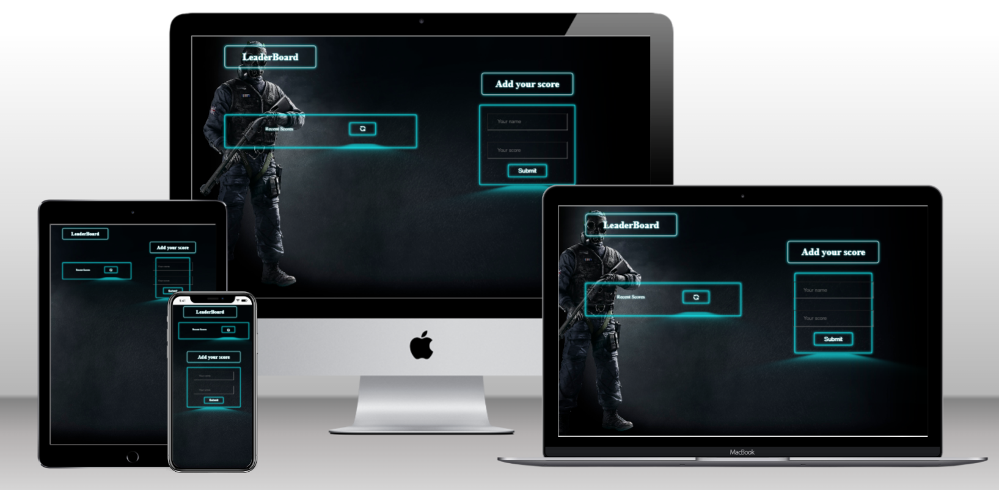

# Awesome Books 

> This is the simple to do list: using webpack that shows of my accomplishments as a software developer.In this project  we learn how to setup the webpack and nodemodules. This project do the to-do-list add , remove and edit function with local storage.

## Built With

- HTML
- CSS
- Javascript
- Webpack
- Es6
- gitflow
  
## 🚀 Live Demo 

Click here to see the [Live Demo](https://soesandarwin2201.github.io/LeaderBoard-project/) of the website 

## Getting Started
To get a local copy up and running follow these simple example steps.

### Clone the repository

 - git clone https://github.com/soesandarwin2201/LeaderBoard-project

### Navigate to the folder

- cd LeaderBoard-project

### Prerequisites

A Web Browser (preferably Google Chrome)

### Prerequisites
- A simple web browser (preferably Chrome or Firefox)
- An IDE

### Setup
-  Clone the GitHub Repository
- run this commands in your terminal:
     - `npm install`
     - `npm run build`
     - `npm start`

### Usage
after running `npm start` the website will be opened automatically on your default browser.

 👤 **Soe Sandar Win**

- GitHub: [@SoeSandarWin](https://github.com/soesandarwin2201)
- LinkedIn: [@SoeSandarWin](https://www.linkedin.com/in/soe-sandar-win-softwareengineer/)

## 🤝 Contributing

Contributions, issues, and feature requests are welcome!